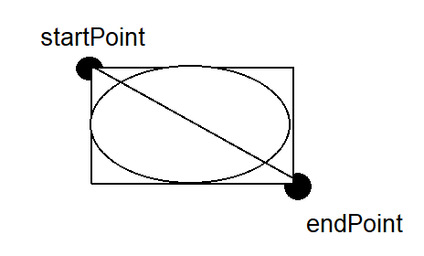
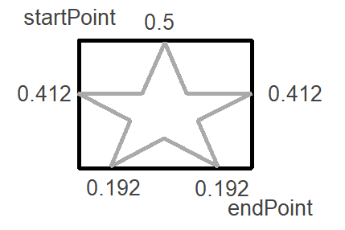

# 基于Qt的Svg编辑器

[TOC]


## 已实现功能：

1. 图形绘制：

- [x] 直线、矩形、圆形的简单绘制
- [x] 直线、矩形、圆形的获取以及高亮显示
- [x] 直线、矩形、圆形的拖拽移动
- [x] 直线、矩形、圆形的拖拽改变形状
- [x] 铅笔自由线、五边形、六边形、文本绘制
- [x] 铅笔自由线、五边形、六边形、文本的获取以及高亮显示
- [x] 铅笔自由线、五边形、六边形、文本的拖拽移动
- [x] 五边形、六边形拖拽改变形状
- [x] 星形图案的绘制
- [x] 星形图案的拖拽移动
- [x] 星形图案拖拽改变形状

2. 画布参数栏

- [x] 画布参数的编辑栏
- [x] 画布宽度、高度、颜色参数的编辑框
- [x] 画布宽度、高度、颜色的编辑
- [x] 画布倍率放大缩小,缩放倍率显示,画布倍率缩放与绘制内容同步
- [x] 支持线宽设置与样式设置
- [x] 图形的默认填充色以及默认边宽
- [x] 修改图形边框颜色、填充颜色

3. 右键菜单栏


- [x] 全选图形功能以及全选快捷键

- [x] 剪切功能以及剪切快捷键

- [x] 复制功能以及复制快捷键

- [x] 粘贴功能以及粘贴快捷键
- [x] 绘画图形置上一层
- [x] 绘画图形置下一层

4. 文件菜单栏

- [x] 新建画布
- [x] 打开svg
- [x] 保存
- [x] 导出PNG


## 0 效果展示

### 界面图

图片文件路径：assets/pic_show.png


### 视频展示

视频文件：assets/SVGEditor.mp4


## 1 系统架构与设计

### 1.1 UML类图

图片路径：assets\UML_class.png


### 1.2 视图层

主界面主要包含3个视图模块：

1. 左侧工具栏。通过KToolBar类实现，包含鼠标工具、画笔工具、线条工具、矩形工具、圆形工具、文本工具、五边形工具、五角星工具、六边形工具等。
2. 中间画布绘画栏。通过KCanvas类实现，监听各类鼠标事件，实现绘画操作及其展示效果。
3. 右侧属性编辑栏。通过KCanvasParamsBar类和KShapeParamsBar类实现，对画布和图形的绘画属性进行修改和调整。画布属性设置包括，图形属性包括边框宽度属性设置、边框颜色、填充颜色、边框样式等设参数设置。


### 1.3 控制层

控制逻辑主要通过KCanvas类，通过对鼠标事件的监听和处理，来实现创建绘画、修改绘画、移动绘画等操作。


以下是主要控制逻辑函数：

- virtual void paintEvent(QPaintEvent* event) ;

​	更新目前绘画的图形效果

- virtual void mousePressEvent(QMouseEvent* event) ;

​	处理图形移动操作、处理选中当前图形操作。

- virtual void mouseMoveEvent(QMouseEvent* event) ;

  处理图形绘画操作，处理图形移动操作、处理图形伸缩变化操作

- virtual void mouseReleaseEvent(QMouseEvent* event) ;

  处理实现新增图形操作

- virtual void mouseDoubleClickEvent(QMouseEvent* event) ;

  处理文本框二次编辑操作


### 1.4 模型层

KShape是所有图形的统一基类，该类创建了drawShape()接口，用来实现不同图形的绘画效果。同时，实现了不同图形之间共有的操作，例如图形移动、图形成员属性的获取和设置等。

图片路径：assets/UML_KShape.png


同时，使用KShapeFactory类的静态函数create实现不同绘画对象的创建。


以下为各个绘画图形的实现类：

- KCircle: 实现椭圆形的绘画。
- KHexgon: 实现椭圆形的绘画。
- KLine:实现直线的绘画。
- KPen:实现自由笔的绘画
- KPentagon：实现五边形的绘画。
- KPentagram: 实现五角星的绘画。
- KRect: 实现矩形的绘画
- KText：实现文本框的绘画


## 2 功能模块实现及设计


### 2.1 直线、矩形、椭圆绘画实现

根据鼠标拖动形成的矩形，从左上角startPoint至右下角endPoint的连线绘制直线，左上角和右下角形成的矩形绘制矩形图案。已矩形的中心点为椭圆的圆心，分别的以矩形的长和宽为椭圆的长轴和短轴绘制成椭圆形。



```C++

void KLine::drawShape(QPaintDevice* parent)
{
	QPainter painter(parent); 
    // 设置边框风格、颜色和宽度
    QPen pen;
    pen.setStyle(m_penStyle);
    pen.setColor(QColor("#" + m_borderColor)); // 确保颜色代码是有效的
    painter.scale(KGlobalData::getGlobalDataIntance()->getCanvasScale(), KGlobalData::getGlobalDataIntance()->getCanvasScale());
    pen.setWidth(m_borderWidth);
    painter.setPen(pen);

    // 设置填充颜色
    QBrush brush(QColor("#" + m_fillColor));
    painter.setBrush(brush);
	painter.drawLine(QLine(getStartPoint(),getEndPoint())); 
}

void KRect::drawShape(QPaintDevice* parent)
{
	QPainter painter(parent); 
    // 设置边框风格、颜色和宽度
    QPen pen;
    pen.setStyle(m_penStyle);
    pen.setColor(QColor("#" + m_borderColor)); // 确保颜色代码是有效的
    pen.setWidth(m_borderWidth);
    painter.setPen(pen);
    painter.scale(KGlobalData::getGlobalDataIntance()->getCanvasScale(), KGlobalData::getGlobalDataIntance()->getCanvasScale());

    // 设置填充颜色
    QBrush brush(QColor("#" + m_fillColor));
    painter.setBrush(brush);
	painter.drawRect(QRect(getStartPoint(),getEndPoint())); 
}

void KCircle::drawShape(QPaintDevice* parent)
{
    QPainter painter(parent);
    // 设置边框风格、颜色和宽度
    QPen pen;
    pen.setStyle(m_penStyle);
    pen.setColor(QColor("#" + m_borderColor)); // 确保颜色代码是有效的
    pen.setWidth(m_borderWidth);
    painter.setPen(pen);
    painter.scale(KGlobalData::getGlobalDataIntance()->getCanvasScale(), KGlobalData::getGlobalDataIntance()->getCanvasScale());
    // 设置填充颜色
    QBrush brush(QColor("#" + m_fillColor));
    painter.setBrush(brush);
    QPoint center = (getStartPoint() + getEndPoint()) / 2;
    int radius_x = ((getEndPoint().x() - getStartPoint().x()) / 2);
    int radius_y = ((getEndPoint().y() - getStartPoint().y()) / 2);
    painter.drawEllipse(center, radius_x, radius_y);
}
```


### 2.2 铅笔线绘画实现

在KPen类中创建一个数组，存储多个点，表示笔痕经过的所有点坐标。通过监听鼠标点击和移动事件，不断向该数组内添加点。其startPoint和endPoint为数组点集中满足坐标最小和最大点，使其组成的矩形能正好包围笔迹形成的点集。

所以，每当整体移动时，需要将数组内所有点均进行移动。


```C++
void KPen::drawShape(QPaintDevice* parent)
{

    QPainter painter(parent);    
    // 设置边框风格、颜色和宽度
    QPen pen;
    pen.setStyle(m_penStyle);
    pen.setColor(QColor("#" + m_borderColor)); // 确保颜色代码是有效的
    pen.setWidth(m_borderWidth);
    painter.setPen(pen); 
    painter.scale(KGlobalData::getGlobalDataIntance()->getCanvasScale(), KGlobalData::getGlobalDataIntance()->getCanvasScale());
    // 设置填充颜色
    QBrush brush(QColor("#" + m_fillColor));
    painter.setBrush(brush);
    if (!m_points.isEmpty()) 
    {
        for (int i = 1; i < m_points.size(); ++i) 
        {
            painter.drawLine(m_points[i - 1], m_points[i]);  // 绘制每一段线条
        }
    }
}
```


### 2.3 五边形绘画实现

根据鼠标拖动形成的矩形，五边形上顶点在矩形上边的中点处，左右顶点在矩形左右边的0.412比例处，下底边2个顶点在左右0.192比例处。计算该5个顶点坐标，绘制成多边形即可。这样可实现根据startPoint和endPoint定义一个五边形的图形。

由于该五边形由startPoint和endPoint2点定义而成，则可对该五边形进行整体移动和单向拉伸变化。


```C++
void KPentagon::drawShape(QPaintDevice* parent)
{
    QPainter painter(parent);
    // 设置边框风格、颜色和宽度
    QPen pen;
    pen.setStyle(m_penStyle);
    pen.setColor(QColor("#" + m_borderColor)); // 确保颜色代码是有效的
    pen.setWidth(m_borderWidth);
    painter.setPen(pen);
    painter.scale(KGlobalData::getGlobalDataIntance()->getCanvasScale(), KGlobalData::getGlobalDataIntance()->getCanvasScale());
    // 设置填充颜色
    QBrush brush(QColor("#" + m_fillColor));
    painter.setBrush(brush);

    // 计算矩形的中心
    QPoint center((m_startPoint.x() + m_endPoint.x()) / 2, (m_startPoint.y() + m_endPoint.y()) / 2);
    // 计算矩形的宽度和高度
    int width = abs(m_endPoint.x() - m_startPoint.x());
    int height = abs(m_endPoint.y() - m_startPoint.y());

    // 使用宽度和高度计算五边形顶点
    QVector<QPoint> vertices = calculateVerticesInRectangle(m_startPoint, m_endPoint);
    //updateBounds(vertices);
    // 绘制五边形
    painter.drawPolygon(vertices.constData(), vertices.size());
}
```


### 2.4 五角星绘画实现

在startPoint和endPoint形成的矩形中，计算出类似五边形的五个顶点坐标。然后按规律将5个点连接五条线段，计算产生的五个交点，根据这10个交点绘画一个包含10个顶点的多边形。即可实现五角星的绘制。

由于该五边形由startPoint和endPoint2点定义而成，则可对该五边形进行整体移动和单向拉伸变化。



```C++

void KPentagram::drawShape(QPaintDevice* parent)
{
    QPainter painter(parent);
    // 设置边框风格、颜色和宽度
    QPen pen;
    pen.setStyle(m_penStyle);
    pen.setColor(QColor("#" + m_borderColor)); // 确保颜色代码是有效的
    pen.setWidth(m_borderWidth);
    painter.setPen(pen);

    // 设置填充颜色
    QBrush brush(QColor("#" + m_fillColor));
    painter.setBrush(brush);
    painter.scale(KGlobalData::getGlobalDataIntance()->getCanvasScale(), KGlobalData::getGlobalDataIntance()->getCanvasScale());
    QVector<QPoint> m_vertices = calculateVerticesInRectangle(m_startPoint, m_endPoint);
    QVector<QPoint> starPoints(10);
    QVector<QPoint> innerVertices(5);
    for (int i = 0; i < 5; ++i) 
    {
        innerVertices[i] = findIntersection(
            m_vertices[i],
            m_vertices[(i + 2) % 5],
            m_vertices[(i + 1) % 5],
            m_vertices[(i + 3) % 5]
        );
    }
    
    for (int i = 0; i < 5; ++i) 
    {
        starPoints[2 * i] = m_vertices[i];
        starPoints[2 * i + 1] = innerVertices[(i+4)%5];
    }

    QPainterPath path;
    path.moveTo(starPoints[0]);
    for (int i = 1; i < 10; i++) 
    {
        path.lineTo(starPoints[i]);
    }
    path.closeSubpath();
    painter.drawPath(path);

}
```


### 2.5 文本框绘画实现

当首次创建KText类后，在鼠标点击处定义为startPoint，并绘制一个默认固定大小的矩形框。在KCanvas中新建一个QLineEdit，输入完成后，将QLineEdit内的文本内容赋值给KText内，并将其显示。

支持二次文本内容编辑，监听鼠标双击事件，在KText的startPoint和endPoint作为对角点，新建一个QLineEdit，并读取KText内的文本内容设置到QLineEdit中，编辑结束后再将输入的内容同步至KText中。


```C++
void KText::drawShape(QPaintDevice* parent)
{
    QPainter painter(parent);    
    // 设置边框风格、颜色和宽度
    QPen pen;
    pen.setStyle(m_penStyle);
    pen.setColor(QColor("#" + m_borderColor)); // 确保颜色代码是有效的
    pen.setWidth(m_borderWidth);
    painter.setPen(pen);
    painter.scale(KGlobalData::getGlobalDataIntance()->getCanvasScale(), KGlobalData::getGlobalDataIntance()->getCanvasScale());

    // 设置填充颜色
    QBrush brush(QColor("#" + m_fillColor));
    painter.setBrush(brush);
    // 创建并设置字体
    QFont font("Arial", 16);  // 选择 Arial 字体，大小为 16
    painter.setFont(font);
    // 计算绘制文本的矩形区域
    QPoint startPoint = getStartPoint();
    QPoint endPoint = getEndPoint();
    QRect textRect(startPoint, endPoint);

    // 绘制文本，使用 Qt::AlignCenter 对齐方式来居中文本
    painter.drawText(textRect, m_text);
}


void KCanvas::mouseDoubleClickEvent(QMouseEvent* event) {
	if (m_edit) {
		m_edit->deleteLater();
		m_edit = nullptr;
	}

	m_pTextShape=static_cast<KText*> (getCurrentShape(rescalePoint(event->pos())));
	if (!m_pTextShape) return;

	if (m_pTextShape->getShapeType() != KShapeType::TextShapeType) return;

	m_edit = new QLineEdit(this);
	QRect rect(m_pTextShape->getStartPoint(), m_pTextShape->getEndPoint());
	m_edit->setGeometry(rect);
	m_edit->setText(m_pTextShape->getText());
	QFont font("Arial", 16);  // 选择 Arial 字体，大小为 16
	m_edit->setFont(font);
	m_edit->selectAll();
	m_edit->setFocus();
	m_edit->show();

	(void)connect(m_edit, &QLineEdit::editingFinished, this, &KCanvas::hideEditor);
}
```


### 2.6 画布宽度、高度、颜色的编辑

画布宽度、画布高度、画布颜色的值均存储在一个单例类中，当这些属性值发生变化时，则会通过槽函数同步更改画布的属性值。


```C++
void KMainWindow::validateCanvasParams()
{
    qint32 width = m_pCanvasParamsBar->m_pWidthBox->m_pParamEdit->text().toInt();
    qint32 height = m_pCanvasParamsBar->m_pHeightBox->m_pParamEdit->text().toInt();
    qint32 scale = m_pCanvasParamsBar->m_pScaleBox->m_pParamEdit->text().toInt();

    KGlobalData::getGlobalDataIntance()->setCanvasWidth(width);
    KGlobalData::getGlobalDataIntance()->setCanvasHeight(height);
    KGlobalData::getGlobalDataIntance()->setCanvasScale(scale/100.0);
    
    m_pSvgMainWin->m_pCanvas->resize(width* scale / 100.0, height* scale / 100.0);
    m_pSvgMainWin->m_pCanvas->setStyleSheet(QString("background-color:#%1").arg(KGlobalData::getGlobalDataIntance()->getCanvasColor()));
}
```

### 2.7 画布倍率放大缩小,缩放倍率显示,画布倍率缩放与绘制内容同步

通过监听鼠标滚轮事件，响应更改全局单例类中的scale属性值，并将画布canvas的宽高修改resize，使其实现画布放大缩小的效果。同时，将放大缩小的倍率重新保存至全局单例类中。

```C++
void KSvgMainWindow::wheelEvent(QWheelEvent* event)
{
	if (QApplication::keyboardModifiers() == Qt::ControlModifier)
	{
		qreal scale = 1.0;
		if (event->delta() > 0)
			scale = KGlobalData::getGlobalDataIntance()->getCanvasScale() + 0.05;
		else
			scale = KGlobalData::getGlobalDataIntance()->getCanvasScale() - 0.05;

		qint32 width = KGlobalData::getGlobalDataIntance()->getCanvasWidth();
		qint32 height = KGlobalData::getGlobalDataIntance()->getCanvasHeight();
		m_pCanvas->resize(width * scale, height * scale);
		KGlobalData::getGlobalDataIntance()->setCanvasScale(scale);
		emit updateScale(scale);
		event->accept();  // 标记事件为已处理
	}
}
```

实现倍率控制后，最关键的处理式将倍率映射到鼠标的坐标映射上。对于每次鼠标坐标获取后，进行一次放缩倍率逆向处理，使其坐标转为相对初始倍率下的统一坐标，使其能在任何倍率下精准控制图形操作。

```C++
QPoint KCanvas::rescalePoint(QPoint point)
{
	point.ry() = point.y() / KGlobalData::getGlobalDataIntance()->getCanvasScale();
	point.rx() = point.x() / KGlobalData::getGlobalDataIntance()->getCanvasScale();
	return point;
}
```

对于图形的缩放，可以在painter上设置缩放值，使其绘画的图形可以随着缩放值的变化而响应发生改变。

```C++
painter.scale(KGlobalData::getGlobalDataIntance()->getCanvasScale(), KGlobalData::getGlobalDataIntance()->getCanvasScale());
```


### 2.8 修改图形边框颜色、填充颜色、边框宽度、边框样式


每当修改该模块属性值，均会触发槽函数，使其修改值更新至全局单例类中。在画布canvas中，定期更新被选中的图形绘画属性。这样即可实现将指定图像更新至最新的属性情况。

```C++
void KShape::updateParams()
{
	m_penStyle = KGlobalData::getGlobalDataIntance()->getBorderStyle();
	m_borderColor = KGlobalData::getGlobalDataIntance()->getShapeBorderColor();
	m_fillColor = KGlobalData::getGlobalDataIntance()->getShapeFillColor();
	m_borderWidth = KGlobalData::getGlobalDataIntance()->getBorderWidth();
}


void KCanvas::handleTimeout()
{
	if (m_pCurrentSelectedShape != Q_NULLPTR)
	{
		if (m_isSelected) 
		{
			m_pCurrentSelectedShape->updateParams();
			update();
		}			
	}	
}
```


### 2.9 全选、复制、剪切、粘贴操作


鼠标在画布上右键，即可触发右键菜单。

全选：将画布中的所有图形地址均保存至一个新的数组中，以便后续再进行统一操作

剪切：将被选中的图形地址从原有数组中删除，不再显示。将其地址保存至另一个指定数组中。

复制：将被选中的图形地址保存至指定数组中，以便后续粘贴操作。

粘贴：将被选中的图形，调用clone()函数，放回一个和原对象属性一直的新对象地址，并加入画布维护的数组中。


```C++
void KCanvas::contextMenuEvent(QContextMenuEvent* event)
{

	m_localContextMenuPos = rescalePoint(event->pos());  // 保存局部坐标
	qDebug() << "contextMenuEvent" << m_localContextMenuPos;
	QMenu contextMenu(this);
	contextMenu.setStyleSheet("QMenu { background-color: #cccccc; color: black; }"
		"QMenu::item { background-color: transparent; }"
		"QMenu::item:selected { background-color: #6699cc; color: white; }");

	// 全选
	QAction* selectAllAction = new QAction(QString::fromLocal8Bit("全选"), &contextMenu);
	selectAllAction->setShortcut(QKeySequence::SelectAll);
	selectAllAction->setShortcutVisibleInContextMenu(true); // 显示快捷键在上下文菜单中
	connect(selectAllAction, &QAction::triggered, this, &KCanvas::selectAllShapes);
	contextMenu.addAction(selectAllAction);

	// 剪切
	QAction* cutAction = new QAction(QString::fromLocal8Bit("剪切"), &contextMenu);
	cutAction->setShortcut(QKeySequence::Cut);
	cutAction->setShortcutVisibleInContextMenu(true);
	connect(cutAction, &QAction::triggered, this, &KCanvas::cutShape);
	contextMenu.addAction(cutAction);

	// 复制
	QAction* copyAction = new QAction(QString::fromLocal8Bit("复制"), &contextMenu);
	copyAction->setShortcut(QKeySequence::Copy);
	copyAction->setShortcutVisibleInContextMenu(true);
	connect(copyAction, &QAction::triggered, this, &KCanvas::copyShape);
	contextMenu.addAction(copyAction);

	// 粘贴
	QAction* pasteAction = new QAction(QString::fromLocal8Bit("粘贴"), &contextMenu);
	pasteAction->setShortcut(QKeySequence::Paste);
	pasteAction->setShortcutVisibleInContextMenu(true);
	connect(pasteAction, &QAction::triggered, this, &KCanvas::pasteShape);
	contextMenu.addAction(pasteAction);

	// 置上一层
	QAction* toTopAction = new QAction(QString::fromLocal8Bit("置上一层"), &contextMenu);
	// 假设您为这个动作设置了自定义快捷键
	toTopAction->setShortcut(QKeySequence("Ctrl+Up"));
	toTopAction->setShortcutVisibleInContextMenu(true);
	connect(toTopAction, &QAction::triggered, this, &KCanvas::toTopActionShape);
	contextMenu.addAction(toTopAction);

	// 置下一层
	QAction* toBottonAction = new QAction(QString::fromLocal8Bit("置下一层"), &contextMenu);
	// 假设您为这个动作设置了自定义快捷键
	toBottonAction->setShortcut(QKeySequence("Ctrl+Down"));
	toBottonAction->setShortcutVisibleInContextMenu(true);
	connect(toBottonAction, &QAction::triggered, this, &KCanvas::toBottonActionShape);
	contextMenu.addAction(toBottonAction);


	contextMenu.exec(event->globalPos());
}

void KCanvas::selectAllShapes()
{
	m_pCurrentSelectedShapeList = m_pShapeList;
	m_isSelected = true;
	// 实现全选逻辑
}

void KCanvas::cutShape()
{

	if (m_pCurrentSelectedShapeList.isEmpty()) {
		QMessageBox::information(this, QString::fromLocal8Bit("提示"), QString::fromLocal8Bit("未选中任何图形"));
		return;
	}
	//m_pCurrentShape = getCurrentShape(m_localContextMenuPos);

	m_pCurrentCutShapeList.clear();//清空暂存数组
	deleteList(m_pCurrentCutShapeList);
	m_pCurrentCutShapeOffsetList.clear();
	m_pCurrentCopyShapeList.clear();//清空暂存数组
	m_pCurrentCopyShapeOffsetList.clear();

	QPoint topLeftPoint = getTopLeftPoint(m_pCurrentSelectedShapeList);
	for (auto& p : m_pCurrentSelectedShapeList)
	{		
		m_pCurrentCutShapeList.prepend(p);// 记录被剪切图形
		m_pCurrentCutShapeOffsetList.prepend(topLeftPoint); //记录相对位置差
		m_pShapeList.removeAll(p);
	}	

	m_isSelected = false;
	m_pCurrentSelectedShapeList.clear();
	update();
	// 实现剪切逻辑
}


void KCanvas::copyShape()
{
	// 实现复制逻辑
	if (m_pCurrentSelectedShapeList.isEmpty()) {
		QMessageBox::information(this, QString::fromLocal8Bit("提示"), QString::fromLocal8Bit("未选中任何图形"));
		return;
	}

	m_pCurrentCutShapeList.clear();//清空暂存数组
	deleteList(m_pCurrentCutShapeList);
	m_pCurrentCutShapeOffsetList.clear();
	m_pCurrentCopyShapeList.clear();//清空暂存数组
	m_pCurrentCopyShapeOffsetList.clear();

	QPoint topLeftPoint = getTopLeftPoint(m_pCurrentSelectedShapeList);
	for (auto& p : m_pCurrentSelectedShapeList)
	{
		m_pCurrentCopyShapeList.prepend(p);// 复制的图形
		m_pCurrentCopyShapeOffsetList.prepend(topLeftPoint); //记录相对位置差
		qDebug() << "Copy" << m_localContextMenuPos;
//		m_pShapeList.removeAll(p);不需要去除
	}

	m_isSelected = false;
	m_pCurrentSelectedShapeList.clear();
	update();
}

void KCanvas::pasteShape()
{// 实现粘贴逻辑
	qDebug() << "paste" << m_localContextMenuPos;
	for (int i = 0; i < m_pCurrentCutShapeList.size(); ++i)
	{
		KShape* p = m_pCurrentCutShapeList[i];
		QPoint offset = m_localContextMenuPos - m_pCurrentCutShapeOffsetList[i];
		p->resetStartPoint(p->getStartPoint() + offset);
		m_pShapeList.prepend(p);// 加入m_pShapeList
	}	
	m_pCurrentCutShapeList.clear();//清空剪切数组
	deleteList(m_pCurrentCutShapeList);
	m_pCurrentCutShapeOffsetList.clear();

	for (int i = 0; i < m_pCurrentCopyShapeList.size(); ++i)
	{
		KShape* p = m_pCurrentCopyShapeList[i]->clone();//克隆一个新的对象
		QPoint offset = m_localContextMenuPos - m_pCurrentCopyShapeOffsetList[i];
		p->resetStartPoint(p->getStartPoint() + offset);
		m_pShapeList.prepend(p);// 加入m_pShapeList
	}
	update();
	m_localContextMenuPos = m_localContextMenuPos + QPoint(50,50);
}
```


### 2.10 置上一层、置下一层实现

将指定的图形由原数组中的下标移动至数组首部，使其最后显示。

```C++
void KCanvas::toTopActionShape()
{
	if (m_pCurrentShape == Q_NULLPTR) return;
	int index = m_pShapeList.indexOf(m_pCurrentShape);  // 找到元素的索引
	if (index != -1) {  // 确保元素存在于列表中
		m_pShapeList.removeAt(index);  // 移除元素
		m_pShapeList.prepend(m_pCurrentShape);   // 在列表首位插入元素
	}
}

void KCanvas::toBottonActionShape()
{
	if (m_pCurrentShape == Q_NULLPTR) return;
	int index = m_pShapeList.indexOf(m_pCurrentShape);  // 找到元素的索引
	if (index != -1) {  // 确保元素存在于列表中
		m_pShapeList.removeAt(index);  // 移除元素
		m_pShapeList.push_back(m_pCurrentShape);   // 在列表末尾插入元素
	}
}
```


### 2.11 新建画布、打开svg、保存、导出PNG

在KMainwindow中创建menubar，实现文件操作。点击对应按钮，运行对应槽函数。

新建：清空当前画布内容。

打开svg：根据指定路径，选择指定svg文件，并导入到svgRenderer中，显示画面。

保存：通过QSvgGenerator类实现保存当前画布内容至svg文件中。

导出png：将当前canvas内容导出为pixmap，将其保存为png文件。

```C++
void KMainWindow::createActions()
{
    m_newAct = new QAction(QString::fromLocal8Bit("新建文件"), this);
    m_newAct->setShortcut(QKeySequence::New);
    connect(m_newAct, &QAction::triggered, this, &KMainWindow::newFile);

    m_openAct = new QAction(QString::fromLocal8Bit("打开SVG"), this);
    m_openAct->setShortcut(QKeySequence::Open);
    connect(m_openAct, &QAction::triggered, this, &KMainWindow::openSVG);

    m_saveAct = new QAction(QString::fromLocal8Bit("保存"), this);
    m_saveAct->setShortcut(QKeySequence::Save);
    connect(m_saveAct, &QAction::triggered, this, &KMainWindow::save);

    m_exportAct = new QAction(QString::fromLocal8Bit("导出PNG"), this);
    m_exportAct->setShortcut(QString::fromLocal8Bit("Ctrl+E"));
    connect(m_exportAct, &QAction::triggered, this, &KMainWindow::exportPNG);
}


void KMainWindow::createMenus()
{

    m_fileMenu->addAction(m_newAct);
    m_fileMenu->addAction(m_openAct);
    m_fileMenu->addAction(m_saveAct);
    m_fileMenu->addAction(m_exportAct);

    m_menuBar->addMenu(m_fileMenu);
}

void KMainWindow::newFile()
{
    m_pSvgMainWin->m_pCanvas->clear();
}

void KMainWindow::openSVG()
{
    QString fileName = QFileDialog::getOpenFileName(this, tr("打开SVG文件"), "", tr("SVG文件 (*.svg)"));
    if (!fileName.isEmpty()) 
    {
        if (m_svgRenderer->load(fileName)) 
        {
            m_pSvgMainWin->m_pCanvas->setRenderer(m_svgRenderer); // 设置渲染器
            m_pSvgMainWin->m_pCanvas->update(); // 更新画布
        }
        else {
            // 处理加载失败的情况
        }
    }
}

void KMainWindow::save()
{
    QString fileName = QFileDialog::getSaveFileName(this, QString::fromLocal8Bit("导出SVG文件"), "", tr("SVG(*.svg)"));
    if (!fileName.isEmpty()) 
    {
        QSvgGenerator generator;
        generator.setFileName(fileName);
        generator.setSize(m_pSvgMainWin->m_pCanvas->size());
        generator.setViewBox(m_pSvgMainWin->m_pCanvas->rect());
        generator.setTitle(QString::fromLocal8Bit("SVG导出"));
        generator.setDescription(QString::fromLocal8Bit("使用QSvgGenerator导出的SVG文件"));

        QPainter painter;
        painter.begin(&generator);
        m_pSvgMainWin->m_pCanvas->render(&painter);
        painter.end();
    }
}

void KMainWindow::exportPNG()
{
    QString fileName = QFileDialog::getSaveFileName(this, QString::fromLocal8Bit("导出PNG文件"), "", tr("PNG(*.png)"));
    if (!fileName.isEmpty()) 
    {
        // 获取画布内容并导出为PNG
        QPixmap pixmap(m_pSvgMainWin->m_pCanvas->size());
        m_pSvgMainWin->m_pCanvas->render(&pixmap);

        if (!pixmap.save(fileName, "PNG")) 
        {
            // 处理保存失败的情况
        }
    }
}
```


## 3 项目不足与未来展望

### 3.1 项目不足

- 无法实现导入svg文件并编辑
- 无法实现编辑undo和redo操作
- 无法实现范围选中

### 3.2 未来展望

- 实现更多图形的绘制
- 实现图形更多属性的设置
- 实现导出svg文件后，打开支持编辑操作